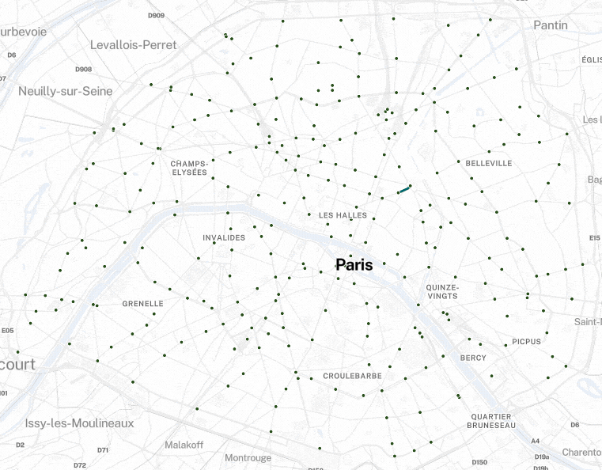

# <a href="https://docs.bikenetkit.org/GrowBikeNet/"></a>

[](https://anaconda.org/conda-forge/growbikenet)
[](https://pypi.org/project/growbikenet/)
[](https://docs.bikenetkit.org/GrowBikeNet/)
[](https://github.com/BikeNetKit/GrowBikeNet/actions/workflows/test.yml)
[](https://codecov.io/gh/BikeNetKit/GrowBikeNet)

The Python package `growbikenet` grows an urban bicycle network from scratch or from an existing bicycle network. You can download street and bike network data with a single line of code, simulate different bicycle network growth scenarios, and export and plot the resulting prioritized growth steps.

[](https://bikenetkit.org/growbikenet)

GrowBikeNet is a decision support tool for urban planners based on the Dutch CROW Design manual for bicycle traffic. It is also useful for proactive citizens to create a compelling vision for urban cycling in their city, and it aims to foster research on bicycle networks. 

GrowBikeNet is fully customizable and data-driven allowing to explore different scenarios - for example, you can import and make use of your own custom data sets like points of interest or traffic flows, or limit network development to specific streets to adapt the software to your local needs.

## When to use
GrowBikeNet works well for most cities on the planet. It can grow a bicycle network from scratch which makes most sense for cities that have only negligible bicycle infrastructure. It can also extend an existing bicycle network, which works best if it is not too developed already.

Recommended example cities to grow from scratch: Athens, Kyiv, Naples

Recommended example cities to extend the existing net: Berlin, Prague, Rome

For alternative approaches, or for cities with more developed bicycle networks, consider using [LinkBikeNet](https://github.com/BikeNetKit/LinkBikeNet) or [FixBikeNet](https://github.com/BikeNetKit/FixBikeNet).

## Installation

### The easy way

The recommended way to install GrowBikeNet is using [`conda`](https://docs.conda.io/projects/conda/en/latest/index.html) (or the faster [`mamba`](https://mamba.readthedocs.io/en/latest/index.html)) via the `conda-forge` channel:

```
conda install growbikenet -c conda-forge
```

### Advanced and development installations
For more installation options, see our [Installation docs](https://docs.bikenetkit.org/GrowBikeNet/installation/).

## Usage
We provide a minimum working example in two formats:

- Python script ([examples/mwe.py](examples/mwe.py))
- Jupyter notebook ([examples/mwe.ipynb](examples/mwe.ipynb))

For a walkthrough with illustrative examples, see our [Usage docs](https://docs.bikenetkit.org/GrowBikeNet/usage/).

## Docs
Find more information in our docs: [https://docs.bikenetkit.org/GrowBikeNet/](https://docs.bikenetkit.org/GrowBikeNet/)


## Source
The source code builds on [the code from the research paper](https://github.com/mszell/bikenwgrowth) _Growing Urban Bicycle Networks_ and on [the code from the research paper](https://github.com/pietrofolco/Data-driven_bicycle_network_planning_for_demand_and_safety) _Data-driven micromobility network planning for demand and safety_.

**Publication** (primary): [https://doi.org/10.1038/s41598-022-10783-y](https://doi.org/10.1038/s41598-022-10783-y)  
**Publication** (secondary): [https://doi.org/10.1177/23998083221135611](https://doi.org/10.1177/23998083221135611)

## How to cite
If you use GrowBikeNet in your research, please cite the primary paper:

> M. Szell, S. Mimar, T. Perlman, G. Ghoshal, R. Sinatra. Growing urban bicycle networks. Scientific Reports 12, 6765 (2022).  
> DOI: [10.1038/s41598-022-10783-y](https://doi.org/10.1038/s41598-022-10783-y)


## Supported by
Development of BikeNetKit/GrowBikeNet is supported by the [Innovation Fund Denmark](https://innovationsfonden.dk/en), the EU HORIZON project [JUST STREETS](https://www.just-streets.eu), and the [Data Science Section](https://en.itu.dk/Research/Sections-and-research-groups/Data-Science) of IT University of Copenhagen.


[](https://innovationsfonden.dk/en) &emsp;&emsp; [](https://commission.europa.eu/index_en) &ensp; [](https://www.just-streets.eu/) 


